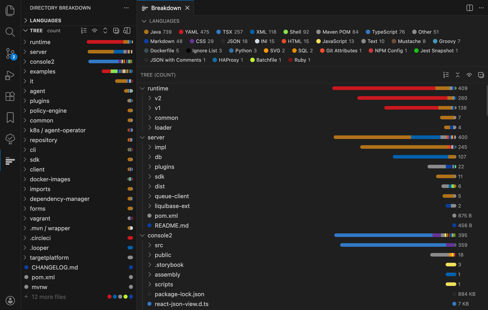

# Directory Breakdown

Visualize per-directory file type composition as GitHub-style colored proportional bars. Unashamedly vibe coded, but it works.



## Features

- **Colored proportional bars** — each directory row shows a bar broken down by language, using the same colors as GitHub's linguist.
- **Sidebar tree view** — browse your workspace directory-by-directory with expandable/collapsible rows.
- **Editor tab view** — open a full-width breakdown panel with a toolbar, sortable columns, and a language legend.
- **Language legend panel** — standalone sidebar panel listing all detected languages with their colors and file counts.
- **Sort modes** — cycle between sort by file count, name (A–Z), and size (bytes).
- **Show/hide ignored files** — toggle visibility of files excluded by `.gitignore` or `files.exclude`.
- **File truncation** — hide minor files per directory to keep the tree compact; expand on demand.
- **Drill-down** — click any directory in the tab view to focus it as the root.
- **Context menus** — right-click rows to copy path, reveal in Explorer, open file, or open in terminal.
- **Auto-rescan** — the tree refreshes automatically when files change (configurable threshold).

## Installation

Search for **Directory Breakdown** in the VSCode Extensions panel, or install from the Marketplace:

```
ext install zwoosh.dirview
```

## Usage

1. Open a workspace folder.
2. Click the **Directory Breakdown** icon in the Activity Bar (left sidebar).
3. The **Languages** panel shows a legend; the **Tree** panel shows the directory breakdown.
4. Use the toolbar icons to sort, toggle ignored files, enable truncation, or open the full editor tab.

## Configuration

| Setting | Default | Description |
|---|---|---|
| `dirview.autoRescanThreshold` | `10000` | Max files before auto-rescan is disabled. Use the Refresh button for large repos. |
| `dirview.maxDepth` | `10` | Maximum directory depth to scan. |
| `dirview.truncateThreshold` | `3` | Max files shown per directory before truncation. Set to `0` to disable. |

## License

MIT — see [LICENSE](LICENSE).
