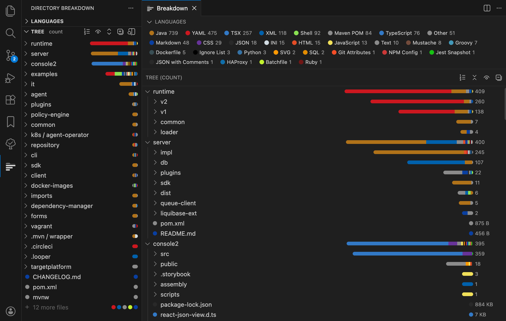

# Directory Breakdown

Visualize per-directory file type composition as GitHub-style colored proportional bars.



Unashamedly vibe coded, but it works. Open a workspace and you get a sidebar tree showing each directory's language breakdown — same colors as GitHub. Good for getting a quick feel for what's in an unfamiliar repo.

## Features

- Proportional color bars per directory, using GitHub linguist colors
- Sidebar tree view and a full-width editor tab with a language legend
- Sort by file count, name, or size
- Filter by language, toggle ignored files, truncate noisy directories
- Drill into any subdirectory as its own tab root
- Open the full breakdown tab from the Command Palette (`Directory Breakdown: Open Breakdown Tab`) or from the sidebar title bar button
- Auto-rescans on file changes

## Installation

Search for **Directory Breakdown** in the Extensions panel, or:

```
ext install zwoosh.dirview
```

MIT — see [LICENSE](LICENSE).
